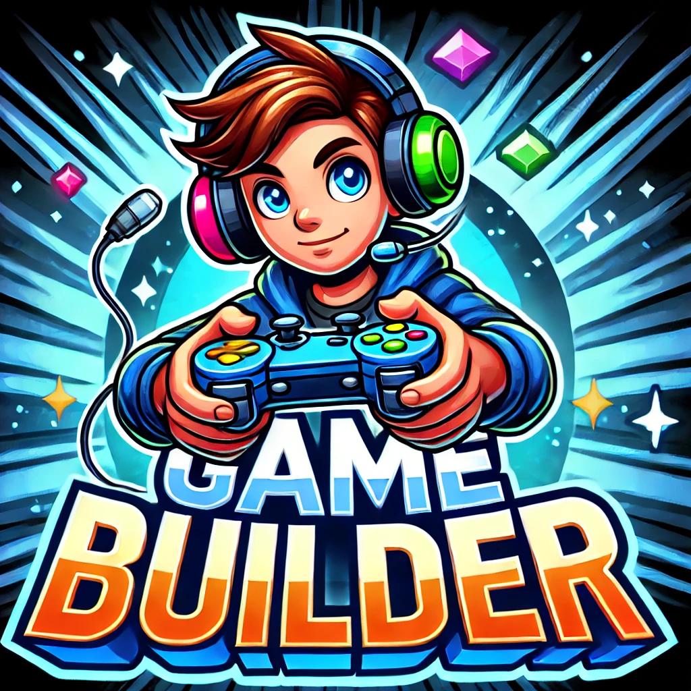
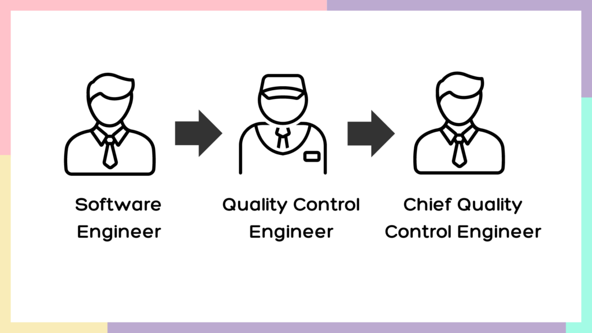
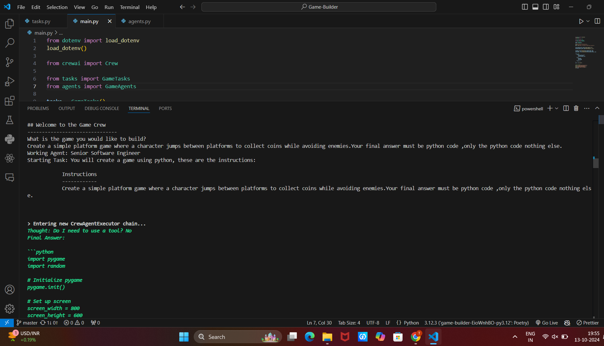
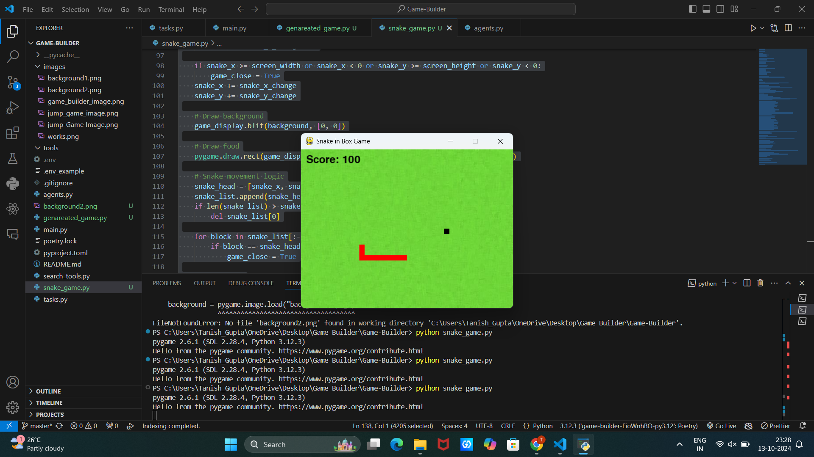
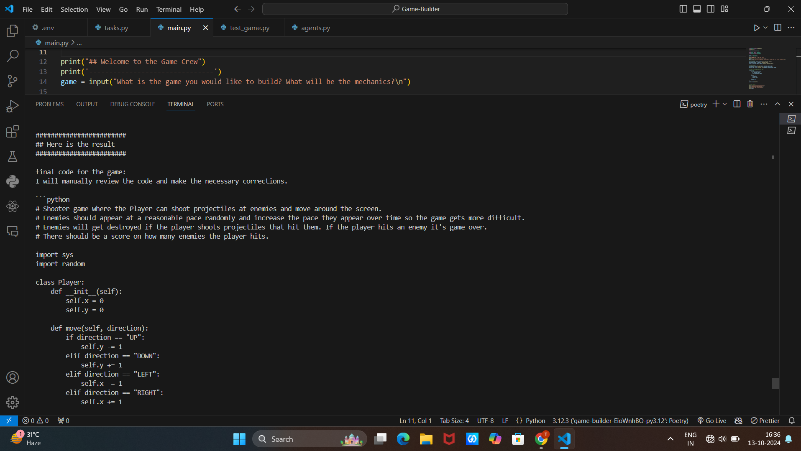
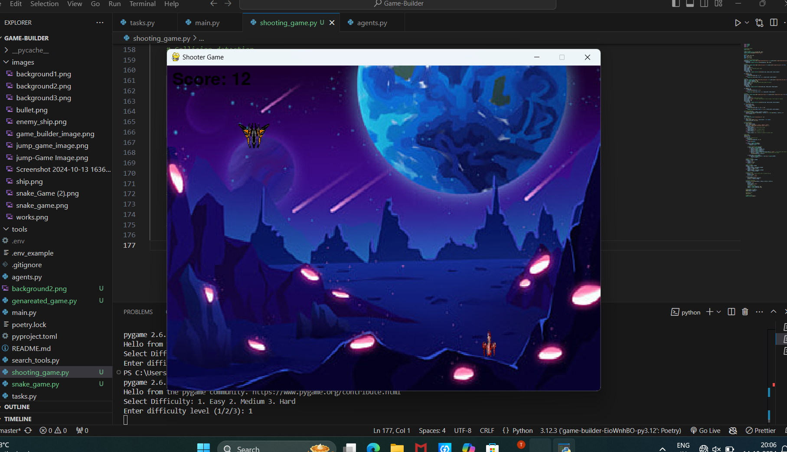

# CrewAi-Game-Builder

**CrewAi-Game-Builder** is an AI-powered tool that allows users to generate Python game code using natural language prompts. It leverages **crewAI** to provide a seamless interface where users can describe their game idea in plain English, and the tool automatically generates fully functional and playable Python code, significantly accelerating the game development process.

<p align="center">
  
</p>

## Table of Contents

- [Overview](#overview)
- [Features](#features)
- [Installation](#installation)
- [How It Works](#how-it-works)
- [Example Workflow](#example-workflow)
- [Screenshots](#screenshots)
- [Documentation](#documentation)
- [Contributing](#contributing)
- [License](#license)

---

## Overview

**CrewAi-Game-Builder** allows users to bypass traditional game development hurdles by automatically generating Python game code. Whether you're looking to create a classic arcade game or a simple puzzle, the AI agent interprets your prompt and provides a ready-to-play game built with `pygame`.

The AI interprets common game elements (such as player movement, obstacles, or scoring systems) and constructs basic game loops with well-structured Python code, making it easy for developers to extend or modify the generated code.

---

## Features

- **Natural Language Processing**: Describe your game in plain English, and CrewAI handles the rest.
- **Automated Python Code Generation**: Instantly receive Python code that runs with `pygame`.
- **Interactive and Playable Games**: The generated code can be played immediately with minimal setup.
- **Customizable Output**: Once generated, the code can be modified to suit your specific requirements.
- **Supports Various Game Genres**: Capable of generating code for multiple game types, including arcade, puzzle, and platform games.

---

## Installation

### Prerequisites

- Python 3.x
- `pygame` library installed
- Access to the **crewAI** platform with valid API credentials

### Steps

1. Clone the repository:

    ```bash
    git clone https://github.com/OfficialTanishGupta/CrewAi-Game-Builder.git
    cd CrewAi-Game-Builder
    ```

2. Install the required dependencies:

    ```bash
    pip install pygame crewai
    ```

3. Set up your **crewAI** API key by adding it to your environment variables or project configuration.

---

## How It Works

**CrewAi-Game-Builder** works by allowing the user to input game requirements as a prompt. The backend AI agent (powered by **crewAI**) interprets this prompt and generates Python code based on the input. The code is saved to a `.py` file, which can be immediately executed to run the game.

### Steps:

1. **User Input**: Provide a natural language prompt describing the game concept. For example, “Generate a snake game where the snake grows longer after eating food.”
2. **AI Code Generation**: The AI processes the input and returns Python code built with the `pygame` library.
3. **Code Execution**: The generated game code can be saved and executed in Python to create a playable game.
4. **Customization**: You can further modify the generated code to add features, refine gameplay, or adjust aesthetics.

<p align="center">
  
</p>

---

## Example Workflow

1. **Input**: You run the program and enter a prompt like:
    ```
    Create a simple platform game where a character jumps between platforms to collect coins while avoiding enemies.
    ```

2. **Output**: The tool generates Python code based on this input and saves it to `generated_game.py`. This code includes:
   - A playable platform character
   - Moving platforms
   - Collectible coins
   - Enemies to avoid

3. **Run the Code**:
    ```bash
    python generated_game.py
    ```

4. **Result**: You will see a fully functional platformer game, with basic elements like jumping, collecting coins, and enemy collision.

---

## Screenshots

### Example Game Screenshots:

<p align="center">
  
  <br><br>
  
</p>

---
## Example Workflow

### Example 1: Snake Game

1. **Input**: You run the program and enter a prompt like:
    ```
    Create a snake game where the snake grows longer after eating food, and the game ends when the snake hits the walls or itself.
    ```

2. **Output**: The tool generates Python code based on this input and saves it to `generated_snake_game.py`. This code includes:
   - A playable snake that grows after consuming food.
   - Scoring system.
   - Game over condition when the snake collides with walls or itself.

3. **Run the Code**:
    ```bash
    python generated_snake_game.py
    ```

4. **Result**: A classic snake game where the snake grows, and the player aims to get a high score.

### Example 2: Shooting Game

1. **Input**: 
    ```
    Create a shooter game where the player controls a spaceship that shoots bullets at enemies appearing from the top of the screen.
    ```

2. **Output**: The tool generates Python code for a space shooter game saved as `generated_shooter_game.py`. This code includes:
   - A spaceship controlled by the player.
   - Enemy ships appearing from the top.
   - Shooting mechanics to destroy enemies.

3. **Run the Code**:
    ```bash
    python generated_shooter_game.py
    ```

4. **Result**: A simple shooting game where the player controls a spaceship and shoots at enemies.
---

## Screenshots

Include screenshots for each game example:

### Example 1: Snake Game Screenshot
<p align="center">
  
</p>
<p align="center">
  
</p>

### Example 3: Shooting Game Screenshot
<p align="center">
  
</p>
<p align="center">
  
</p>

---

## Documentation

### Input Format

You can describe your game using simple sentences. The AI is designed to interpret a variety of prompts, such as:
- **Snake Game**: “Generate a snake game with a scoring system where the snake grows longer after eating food.”
- **Platformer Game**: “Create a platform game where a player jumps between platforms to reach the goal.”
- **Shooter Game**: “Build a shooting game where enemies appear on the screen and the player must shoot them down.”

### Game Genres Supported
- **Arcade games**
- **Platformers**
- **Puzzle games**
- **Shooter games**
- **Endless runner games**

### Output Code Structure

The generated code follows a clean, organized structure, allowing for easy reading and customization. A typical structure includes:
- Initialization of the game environment
- Game loop (handling events, updating game state, and rendering)
- Player controls
- Collision detection
- Scoring mechanism

You can extend the code by adding additional features such as power-ups, sound effects, or different levels.

---

## Contributing

Contributions are welcome! If you have ideas for improvements or new features, feel free to open an issue or create a pull request. Here’s how you can contribute:
1. Fork the repository.
2. Create a new branch (`git checkout -b feature-branch`).
3. Make your changes and commit (`git commit -m 'Added new feature'`).
4. Push to the branch (`git push origin feature-branch`).
5. Open a Pull Request.

---

## License

This project is licensed under the MIT License - see the [LICENSE](LICENSE) file for details.
